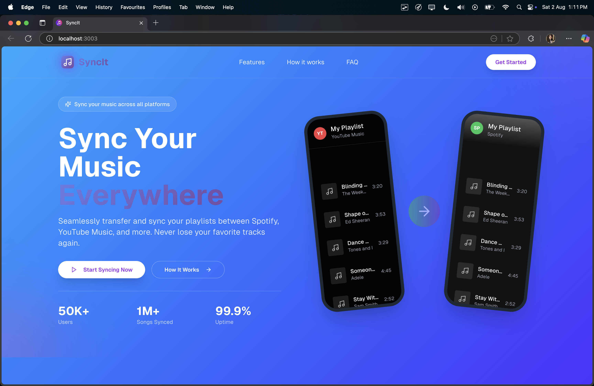
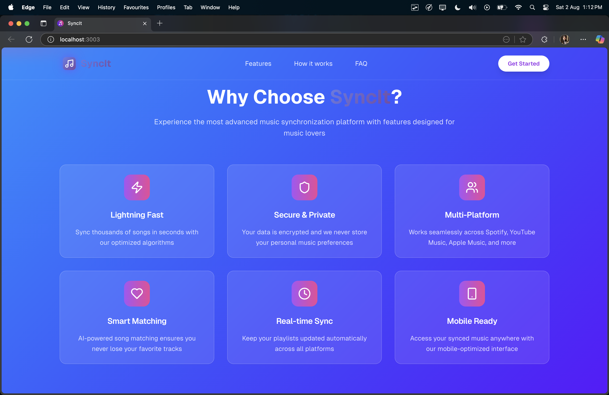
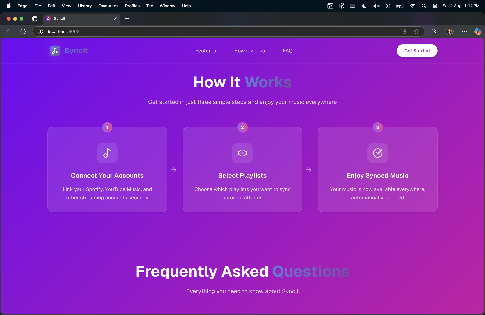
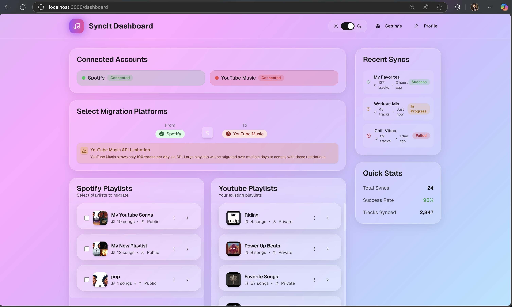
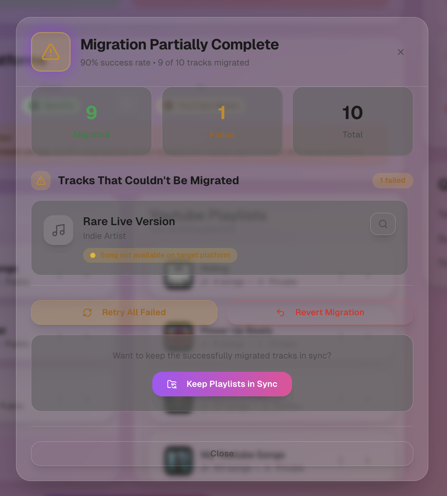
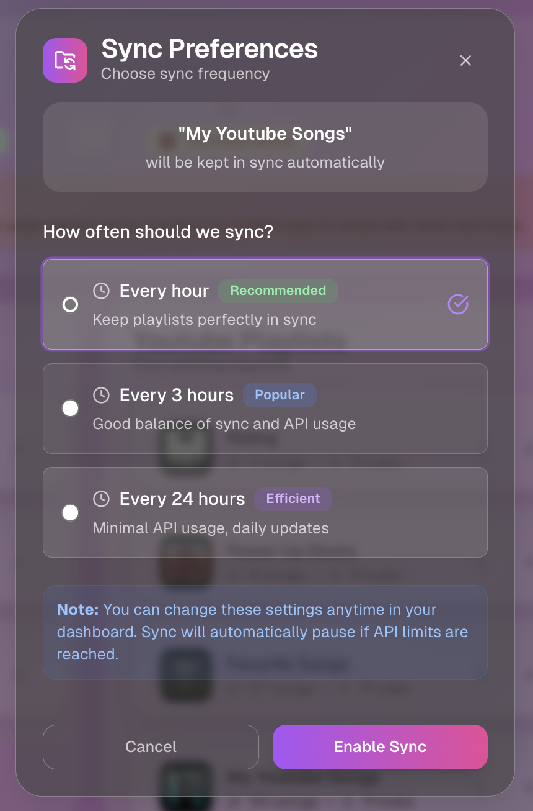

# SyncIt Backend
The SyncIt Backend is a robust and scalable Express.js application that powers SyncIt, a next-generation music synchronization platform. It seamlessly syncs playlists and liked songs across multiple streaming services, including Spotify and YouTube Music, while also supporting effortless playlist migration between platforms.

Built with a modular design, the backend ensures seamless extensibility, making it easy to integrate additional platforms like Apple Music, Deezer, and more. As the core engine of the SyncIt ecosystem, it efficiently handles cation, API requests, data processing, and synchronization tasks with high performance and reliability. Designed for scalability and future enhancements, SyncIt provides a flexible foundation for cross-platform music management and future platforms integrations.

SyncIt waitlist is live! 🚀🎵 Join the waitlist now: https://syncit.org.in/ 🔥

## 🖥️ Client Preview

This backend powers the SyncIt frontend, which provides a modern interface for managing and syncing music across platforms.

<p align="center">
  
</p>

<table align="center">
  <tr>
    <td align="center">
      <br/>
    </td>
    <td align="center">
      <br/>
    </td>
  </tr>
</table>

<details>
<summary>▶️ View more screens</summary>

<br>







## 🚀 Features (Planned & In Development) ✨ – SyncIt Backend

- Scalable Architecture: Built with Express.js, ensuring efficient handling of API requests, authentication, and data synchronization.
- Multi-Platform Support: Designed to integrate with more music streaming services beyond Spotify and YouTube Music in future updates.
- Robust Caching: Implements Redis for caching frequently accessed data, improving performance and reducing API request overhead.
- Rate Limiting & Security: Protects against abuse with rate limiting, API throttling, and enhanced security measures.
- OAuth Authentication: Secure login and access token management for Spotify, YouTube, and other future integrations.
- Real-Time Data Processing: Syncs and updates user data dynamically, ensuring the latest changes reflect across platforms.
- Android App Compatibility: Optimized to support a future Android app, extending SyncIt’s functionality to mobile users.
- Extendable & Modular: Built with flexibility in mind, allowing easy integration of additional music platforms and new features.
## Technologies Used 🛠
SyncIt Backend is built with modern technologies for performance, scalability, and security.

🛠 Core Stack

- Node.js – Runtime environment for executing JavaScript on the server.
- Express.js – Lightweight framework for handling API requests and routing.
- TypeScript – Statically typed superset of JavaScript for improved code  maintainability and safety.

📡 Database & ORM
- Prisma – Modern ORM for database management with TypeScript support.
- PostgreSQL – Supports relational databases for efficient data storage.

⚡ Performance & Optimization

- Redis (ioredis) (Planned) – Used for caching frequently accessed data, reducing API calls, and improving performance.
- esbuild – High-performance bundler for efficient TypeScript compilation.

🔐 Security 

- OAuth 2.0 – Secure authentication for Spotify, YouTube, and other platforms.
- express-session – Manages user sessions securely.
- Zod – Schema validation for request and response data integrity.

📡 API & Networking

- Axios – HTTP client for making API requests to external services.
- CORS – Middleware for handling cross-origin requests.
## 📂 Project Structure
```
SyncIt-Client/
├── prisma/
    ├── migrations/
    ├── schema.prisma - Database models
    ├── seed.ts - seed file for development
├── src/
    ├── OAuth/ - Authentication files
    ├── Scheduler/ - Cron jobs
    ├── backend/ 
        ├── extractTracks - Extract tracks from playlists
        ├── modify - Modify playlists
        ├── openAI - LLM 
        ├── playlistCRUD - Playlist CRUD operations
        ├── routeHandlers 
        server.ts    
    ├── config/ 
    ├── middlewares/ 
|── tests/
├── .gitignore          
├── README.md
|──jest.config.js
├── package-lock.json        
├── package.json       
├── tsconfig.json          
```


## 🛠 Development

Clone the project
```bash
git clone https://github.com/x15sr71/SyncIt-Backend.git
cd SyncIt-Backend
```
Install Dependencies
```
npm install 
```

create a .env similar to .env.example
set NODE_ENV to "development"

Ensure your PostgreSQL database and Redis is running. If you're using a local PostgreSQL instance, set up your database as specified in the DATABASE_URL.


Run database migrations

```
npx prisma migrate dev
```
Start Development Server
```
npm run dev
```
Build for Deployment
```
npm run build
```
    
## 🤝 Contributing

We welcome contributions from the community! Whether it’s fixing bugs, improving documentation, or adding new features, your help is always appreciated.  
Feel free to fork the repo, open issues, or submit pull requests to make SyncIt even better. 🚀
