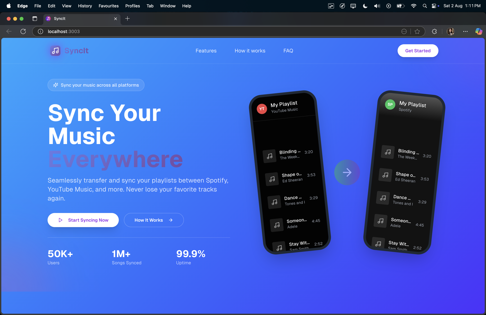
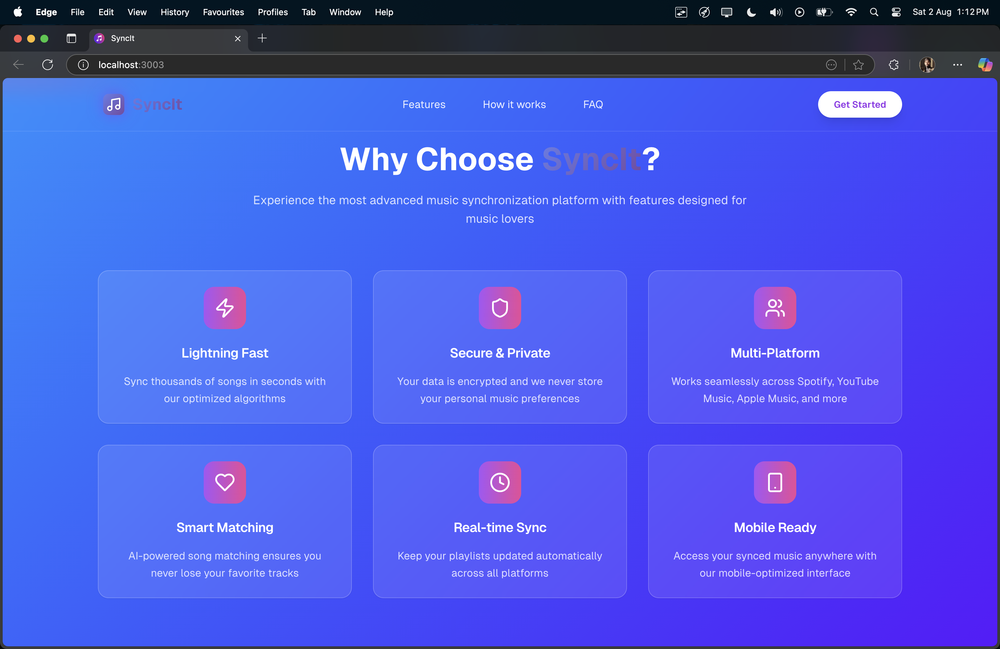
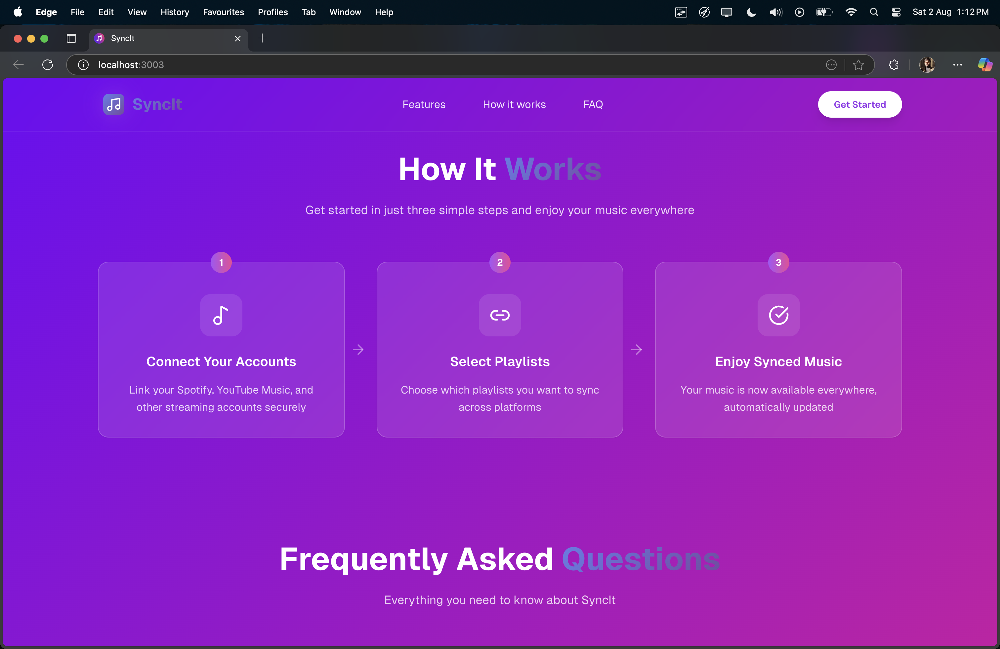
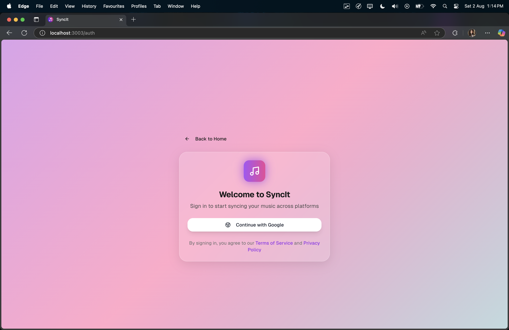
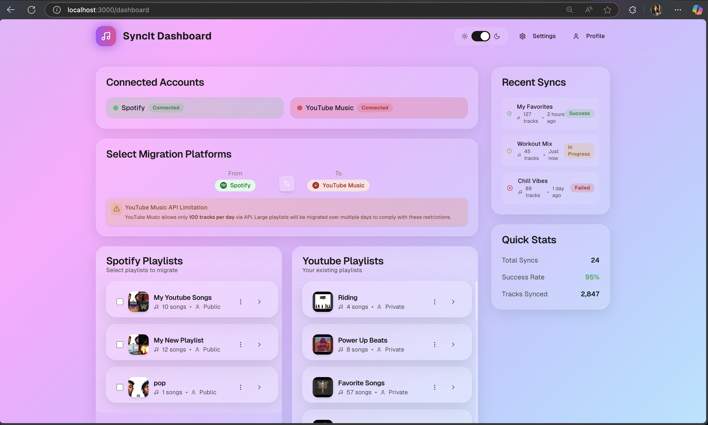
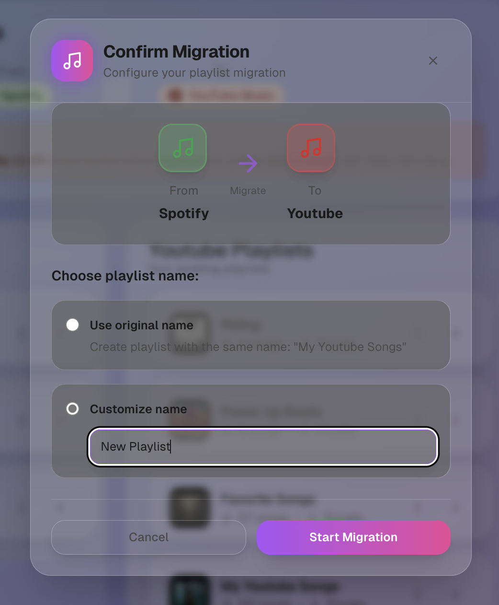
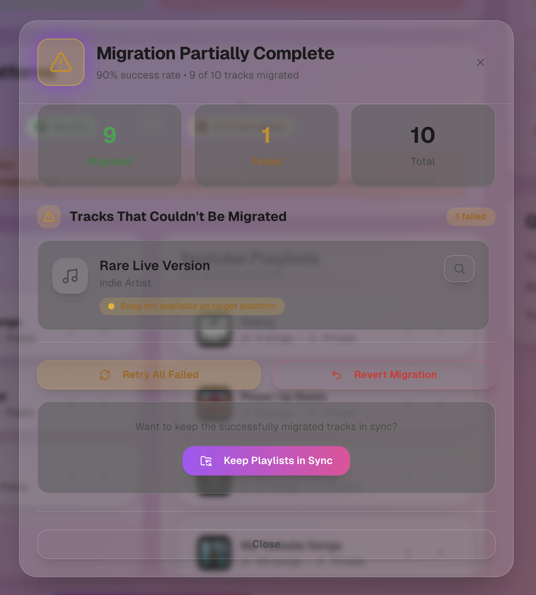
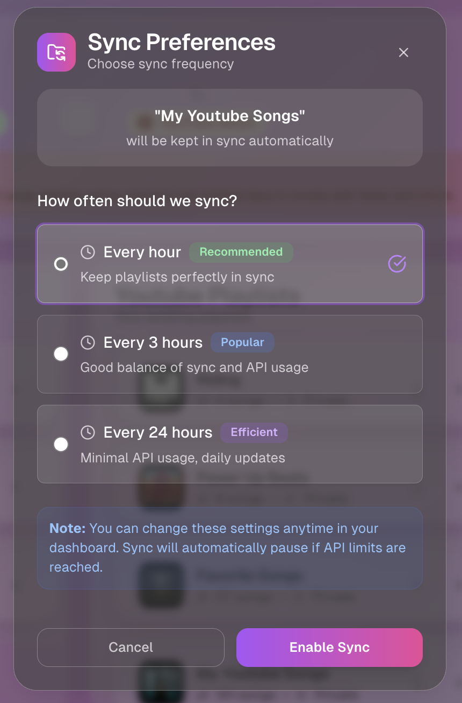
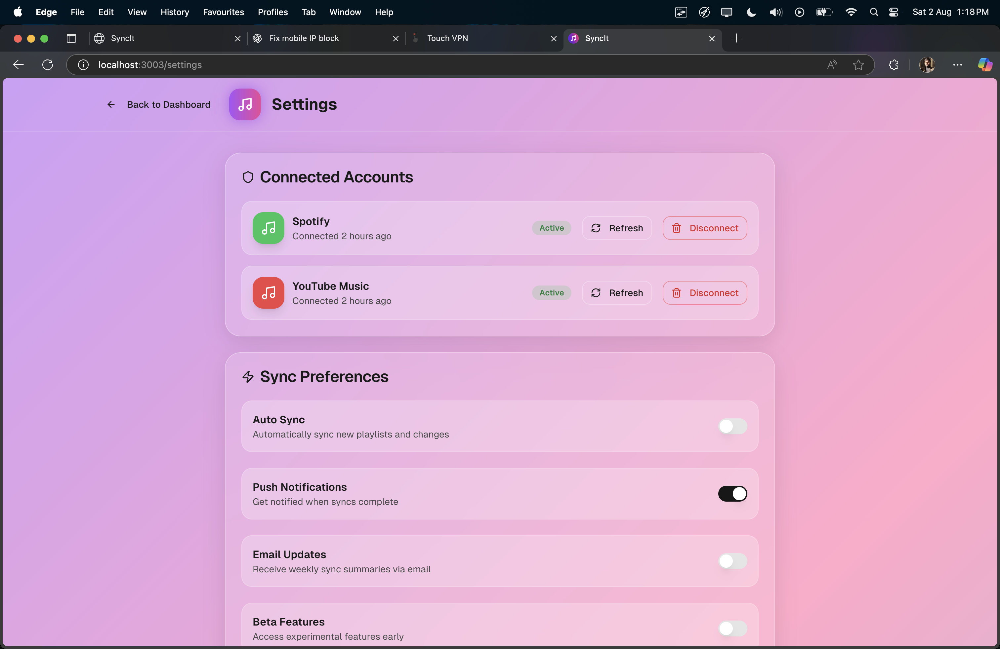

# SyncIt Backend
The SyncIt Backend is a robust and scalable Express.js application that powers SyncIt, a next-generation music synchronization platform. It migrates and auto-syncs playlists between Spotify and YouTube Music. (Liked-songs sync is currently unavailable: Spotify removed the `/me/tracks` API in February 2026; the endpoints return 501 until rebuilt on the new library API.)

Built with a modular design, the backend ensures seamless extensibility, making it easy to integrate additional platforms like Apple Music, Deezer, and more. As the core engine of the SyncIt ecosystem, it efficiently handles cation, API requests, data processing, and synchronization tasks with high performance and reliability. Designed for scalability and future enhancements, SyncIt provides a flexible foundation for cross-platform music management and future platforms integrations.

SyncIt waitlist is live! 🚀🎵 Join the waitlist now: https://syncit.org.in/ 🔥

## 🖥️ Client Preview

This backend powers the SyncIt frontend, which provides a modern interface for managing and syncing music across platforms.

<p align="center">
  
</p>

<table align="center">
  <tr>
    <td align="center">
      <br/>
    </td>
    <td align="center">
      <br/>
    </td>
  </tr>
</table>

<details>
<summary>▶️ View more screens</summary>

<br>







</details>

## 🚀 Features (Planned & In Development) ✨ – SyncIt Backend

- Scalable Architecture: Built with Express.js, ensuring efficient handling of API requests, authentication, and data synchronization.
- Multi-Platform Support: Designed to integrate with more music streaming services beyond Spotify and YouTube Music in future updates.
- Robust Caching: Implements Redis for caching frequently accessed data, improving performance and reducing API request overhead.
- Rate Limiting & Security: Protects against abuse with rate limiting, API throttling, and enhanced security measures.
- OAuth Authentication: Secure login and access token management for Spotify, YouTube, and other future integrations.
- Real-Time Data Processing: Syncs and updates user data dynamically, ensuring the latest changes reflect across platforms.
- Android App Compatibility: Optimized to support a future Android app, extending SyncIt’s functionality to mobile users.
- Extendable & Modular: Built with flexibility in mind, allowing easy integration of additional music platforms and new features.
## Technologies Used 🛠
SyncIt Backend is built with modern technologies for performance, scalability, and security.

🛠 Core Stack

- Node.js – Runtime environment for executing JavaScript on the server.
- Express.js – Lightweight framework for handling API requests and routing.
- TypeScript – Statically typed superset of JavaScript for improved code  maintainability and safety.

📡 Database & ORM
- Prisma – Modern ORM for database management with TypeScript support.
- PostgreSQL – Supports relational databases for efficient data storage.

⚡ Performance & Optimization

- Redis (ioredis) (Required) – Backs session caching, one-time OAuth state nonces, per-user sync locks, and rate limiting. Login does not work without it.
- esbuild – High-performance bundler for efficient TypeScript compilation.

🔐 Security 

- OAuth 2.0 – Secure authentication for Spotify, YouTube, and other platforms.
- express-session – Manages user sessions securely.
- Zod – Schema validation for request and response data integrity.

📡 API & Networking

- Axios – HTTP client for making API requests to external services.
- CORS – Middleware for handling cross-origin requests.
## 📂 Project Structure

The backend follows a modular, service-oriented architecture with clear separation between routing, business logic, and external integrations.

```text
SyncIt-Backend/
├── assets/
│   └── screenshots/        # UI preview images used in README
├── prisma/
│   ├── migrations/         # Database migration history
│   ├── schema.prisma       # Prisma schema (DB models)
│   └── seed.ts             # Seed script for development
├── scripts/
│   └── generateDocs.ts     # Script to generate API docs
├── src/
│   ├── auth/               # OAuth integrations (Spotify, YouTube, Google)
│   ├── backend/
│   │   ├── controllers/    # Request handlers (business entry points)
│   │   ├── routes/         # API route definitions
│   │   ├── services/       # Core business logic (sync, migration, search)
│   │   ├── openAI/         # LLM-based track matching
│   │   ├── docs/           # Swagger/OpenAPI definitions
│   │   ├── utility/        # Helper utilities (encryption, formatting, etc.)
│   │   └── server.ts       # Express app entry point
│   ├── config/             # Configuration (Redis, env setup)
│   ├── cron/               # Cron service logic
│   ├── jobs/               # Background jobs (sync, migration)
│   ├── db/                 # Database connection & Prisma client
│   ├── generated/          # Prisma-generated client (auto-generated, do not edit)
│   ├── middlewares/        # Express middlewares (sessions, auth)
│   └── startup/            # App bootstrap logic
├── tests/                  # Unit and integration tests
├── openapi-syncit.json     # Generated OpenAPI specification
├── prisma.config.ts        # Prisma configuration
├── jest.config.js
├── package.json
├── tsconfig.json
└── README.md
```


## 🛠 Development

Clone the project
```bash
git clone https://github.com/x15sr71/SyncIt-Backend.git
cd SyncIt-Backend
```
Install Dependencies
```
npm install 
```

Create a `.env` from `.env.example` and fill in every value. Notes that matter:

- **`DIRECT_URL` is required** in addition to `DATABASE_URL`: Prisma 7's CLI reads only `DIRECT_URL` (via `prisma.config.ts`) for migrations. On Supabase, `DATABASE_URL` is the pooled 6543 URL and `DIRECT_URL` the direct 5432 URL.
- **Redis is required**, not optional — OAuth login, session caching, sync locks, and rate limiting all use it.
- **Use `127.0.0.1` everywhere in dev**, not `localhost`: Spotify only accepts loopback-IP redirect URIs, and session cookies are host-scoped, so the Google/YouTube/Spotify redirect URIs, `FRONTEND_URL`, and the URL you open in the browser must all agree. Open the client at `http://127.0.0.1:3000`.
- `TOKEN_ENC_KEY` (32 random bytes, base64) encrypts OAuth tokens at rest: `openssl rand -base64 32`.

Ensure PostgreSQL and Redis are running, then apply migrations:

```
npx prisma migrate deploy   # or `npx prisma migrate dev` when changing the schema
```

Start Development Server
```
npm run dev
```
Run tests / typecheck
```
npm test
npx tsc --noEmit
```
Build for Deployment
```
npm run build
```

### Production cookie strategy (client ↔ backend)

The session cookie is `sameSite: 'lax'`, which browsers do not send on
cross-site XHR. The supported deployment shape is the **same-origin proxy**:
the Next.js client rewrites `/api/backend/:path*` to this backend, the
browser only ever talks to the client origin, and OAuth provider redirect
URIs point at `https://<client-domain>/api/backend/{google,spotify,youtube}/callback`.

Alternative (documented, not wired): host client and backend on subdomains of
one registrable domain (e.g. `app.example.com` + `api.example.com`), set the
cookie with `domain: '.example.com'`, `sameSite: 'none'`, `secure: true`, and
add CSRF hardening — only worth it if the proxy hop is unacceptable.

### Docker

```
docker compose up --build   # backend + Postgres + Redis, healthcheck on /health
```
    
## 🤝 Contributing

We welcome contributions from the community! Whether it’s fixing bugs, improving documentation, or adding new features, your help is always appreciated.  
Feel free to fork the repo, open issues, or submit pull requests to make SyncIt even better. 🚀
